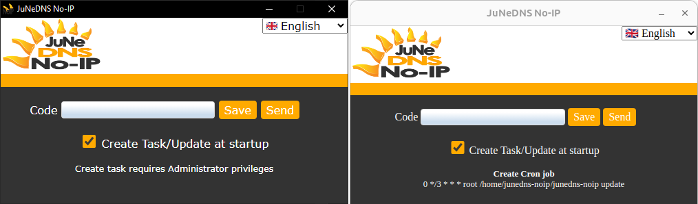

  

<h1 align="center">
  <a href="https://github.com/EduardoRuizM/junedns-noip">EduardoRuizM/junedns-noip</a>
</h1>

  Dataclick Olimpo <a href="https://junedns.com">☀️JuNeDNS No-IP</a>
  Safe, Lightweight and Full DNS Server ideal for single or hosting servers
  https://www.junedns.com

# [☀️JuNeDNS No-IP](https://junedns.com "JuNeDNS No-IP") (Dynamic DNS)
## 🌐 Update dynamic IP to static host for [JuNeDNS Backend](https://github.com/EduardoRuizM/junedns-backend "JuNeDNS Backend")

JuNeDNS is a lightweight DNS server, backend and frontend created in Node.js with a fully functionality and easy installation and use. With templates to easily create domain zones.

**JuNeDNS No-IP** is the Dynamic DNS (DDNS) method for automatically update a name server in real time, so it sends a request when the computer starts or every certain time (3 days by default), and so as you are sending your IP address, you can associate an A or AAAA record with a host to your dynamic IP.

Then you can have a host address like `mycomputer.mydomain.tld` pointing to your dynamic IP which will be updated with the IP of your connection/router.

It´s a way to have static IP through a host with dynamic IP, something useful for security systems of access by allowed IPs.

JuNeDNS No-IP is made with [Electron](https://www.electronjs.org "Electron") to build a cross-platform desktop app, and compiled binaries with [Electron Forge](https://www.electronforge.io "Electron Forge") for 🪟 Windows, 🐧Linux or 🍎MacOS.

# Author
[Eduardo Ruiz](https://github.com/EduardoRuizM) <<eruiz@dataclick.es>>

# [JuNe](https://just-needed.com "JuNe") / JUst NEeded Philosophy
1. **Source code using less code as possible**
  So you can understand code and find bugs easier.
2. **Few and optimized lines is better**
  Elegant design.
3. **Avoid external dependences abuse/bloated, and possible third-party bugs**
  Less files size, better and faster to the interpreter.
4. **Clear and useful documentation with examples and without verbose**
  Get to the point.
5. **Avoid showing unsolicited popups, notifications or messages in frontend**
  For better User eXperience.
6. **Simple UI**, without many menus/options and with few clicks to get to sites.
7. Consequences of having a lot of code (and for simple things): Having to work and search through many files and folders with a lot of wasted time, successive errors due to missing unknown files, madness to move a code to another project, errors due to recursive dependencies difficult to locate, complexity or impossibility to migrate to new versions, unfeasibility to follow the trace with so much code, risk of new errors if the functionality is extended, problems not seen at the first sight, general slowness in the whole development due to excessive and unnecessary code.

# Installation
### 1. Install and configure [JuNeDNS Backend](https://github.com/EduardoRuizM/junedns-backend "JuNeDNS Backend")

### 2. Install JuNeDNS No-IP *Electron* dependencies with `npm install`

⚠ To try JuNeDNS No-IP from source code for run `npm start` or packager with the `package.json` ➔ scripts ➔ paths are for *Electron* Windows-format and local installation:
`node_modules\\.bin\\electron .` and `node_modules\\.bin\\electron-packager` change this path if necessary for Linux or MacOS.

### 3. Change your public backend URL
- As included configuration in executable with `server.js` at line 33: `backend_url = 'https://mydomain.tld:9053';`
- As external configuration file `junedns-noip.conf` in `backend_url` parameter.
  (use only this external option in case you need to change the *backend_url* at runtime)
- Do not end backend_url with /

### 4. Compile and generate your executable (x64)
⚠ Change `package.json` scripts paths if necessary, currently: `node_modules\\.bin\\electron-packager`

| OS | Command |
| --- | --- |
| ALL | npm run build |
| 🪟 Windows | npm run build-win |
| 🐧Linux | npm run build-linux |
| 🍎MacOS | npm run build-macos |

# Snapshot

User must enter the No-IP code generated by JuNeDNS Backend or JuNeDNS Frontend.

- This code is stored in external configuration file `junedns-noip.conf` in `code` parameter.
- To update simply using the previously saved stored code, and in the command line, just add the `update` parameter, sample: `JuNeDNS-NoIP update` this is performed in automatic updates.
- TTL time record must be low, set **60** (seconds) for a minute for fast DNS propagation.

## Configuration file
File `junedns-noip.conf` with 2 possible parameters:

**backend_url=https://mydomain.tld:9053** backend URL instead of in `server.js` file.
**code=?** stored code to send, and using if executable parameter is `update` for automatic updates.

# IPv4 and IPv6
To update a DNS address record, it´s important whether you need IPv4 or IPv6, for example if you require IPv4, you may be connected through IPv6, if this service is offered by your ISP.
Therefore you have to force to connect with an IPv4 address in order not to send the IPv6 address.

#### Only IPv4 in a mixed IPv4+IPv6 domain
| Record Type | Description | Sample name |
| :---: | --- | --- |
| A | Main domain IPv4 address | mydomain.tld |
| AAAA | Main domain IPv6 address | mydomain.tld |
| A | Subdomain only IPv4 address | ip4.mydomain.tld |

Remember to add *ip4.mydomain.tld* to your domain hosting panel, with access to JuNeDNS Backend,
then you can configure JuNeDNS No-IP to connect to *ip4.mydomain.tld* to update IPv4 dynamic address.

## 🏳Languages
Help us to translate JuNeDNS in your language 📩 info@junedns.com

| Code | Short code | Language |
| :---: | --- |
| en-US | en | 🇬🇧 English |
| es-ES | es | 🇪🇸 Español |
| fr-FR | fr | 🇫🇷 Français |
| de-DE | de | 🇩🇪 Deutsch |
| it-IT | it | 🇮🇹 Italiano |
| pt-PT | pt | 🇵🇹 Português |
| zh-CN | ch | 🇨🇳 中文 |

## To run automatically to ensure DNS update
### What JuNeDNS No-IP does internally?
(generating the necessary files and calling executable with *update* command line parameter).

### 🪟 Windows
Create a **Task Scheduler** for: boot trigger, session unlock and every 3 hours (Administrator privileges).
`schtasks /Create /TN JuNeDNS-NoIP /XML JuNeDNS-NoIP.xml`

### 🐧Linux
Add for logon in **~/.bash_profile** (root privileges).
`/etc/junedns/junedns-noip`
You need root access to add a Cron job every 3 hours in **/etc/crontab**
`0 */3 * * * root /etc/junedns/junedns-noip`

### 🍎MacOS
Create a **LaunchAgent** to update on: run at load and every 3 hours.
`launchctl load -w ~/Library/LaunchAgents/JuNeDNS-NoIP.plist`

# JuNeDNS Server & Backend & No-IP
https://github.com/EduardoRuizM/junedns-server
https://github.com/EduardoRuizM/junedns-backend
https://github.com/EduardoRuizM/junedns-frontend

# [JuNe](https://just-needed.com "JuNe") Development Ecosystem
Everything you need to develop your project:
### Backend
- [JuNe BackServer](https://github.com/EduardoRuizM/june-backserver "JuNe BackServer") With request routing, tokens, file upload, send Emails, WebSockets, SSE and captcha.
- [JuNe WebServer](https://github.com/EduardoRuizM/june-webserver "JuNe WebServer") Web server with HMR.

### Frontend
- [JuNe PaulaJS](https://paulajs.com "JuNe PaulaJS") Powerful JavaScript framework - [GitHub](https://github.com/EduardoRuizM/june-paulajs "GitHub")
- [JuNe CSS](https://github.com/EduardoRuizM/june-css "JuNe CSS") Full responsive CSS library with icons.

# Trademarks©️
**Dataclick Olimpo JuNeDNS**
- [Dataclick.es](https://www.dataclick.es "Dataclick.es") is a software development company since 2016.
- [Olimpo](https://www.dataclick.es/en/technology-behind-olimpo.html "Olimpo") is a whole solution software to manage all domains services such as hosting services and to create Webs in a server.
- [JuNe](https://just-needed.com "JuNe") / JUst NEeded Philosophy, available software and development solutions.
- [JuNeDNS](https://junedns.com "JuNeDNS") is a part of Dataclick Olimpo domains management for DNS service, released to Internet community.
- Feel free to use JuNeDNS acording MIT license respecting the brand and image logotype that you can use.
